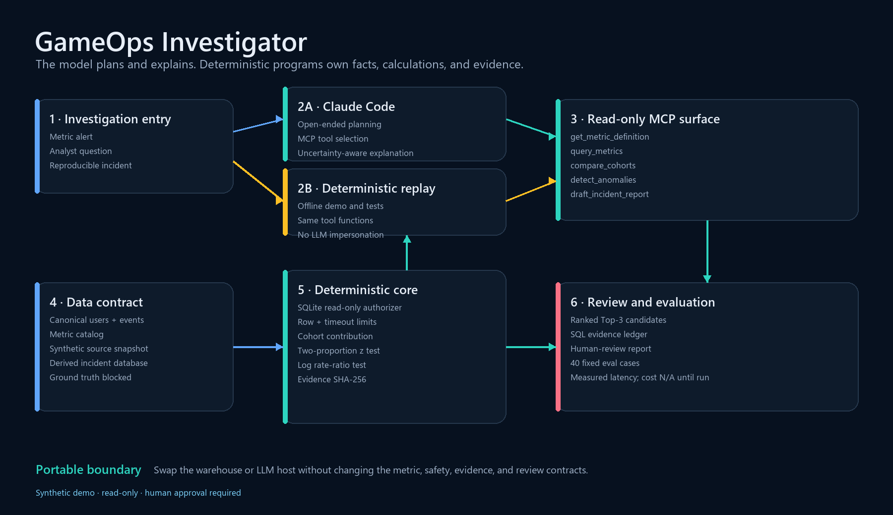
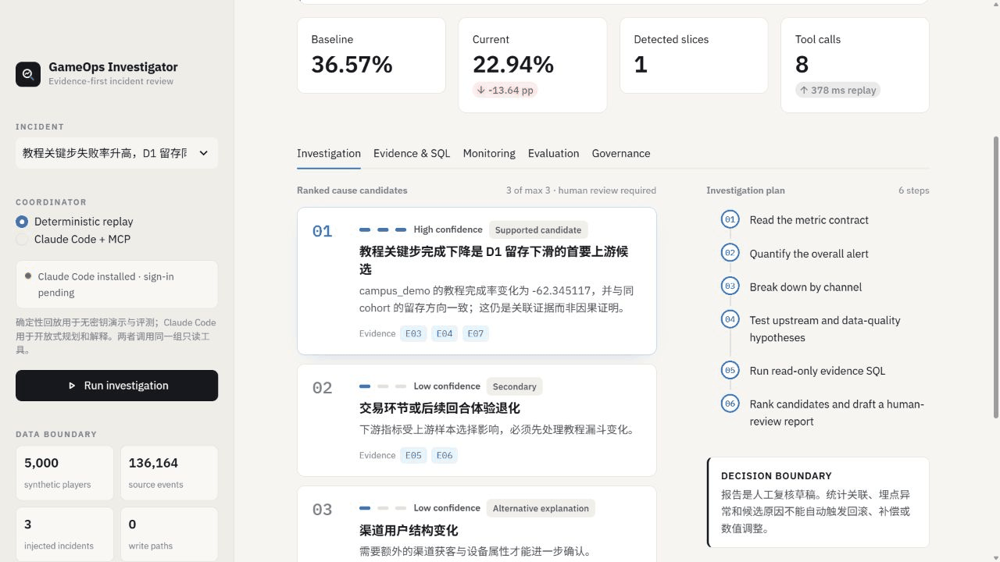

# GameOps Investigator

> **English overview** — An evidence-first game operations incident investigation agent built around metric contracts, read-only SQL, cohort comparison, anomaly testing, and citation-checked reports. The repository uses synthetic data; **17 automated tests** and a **40-case deterministic offline evaluation** validate the tool, safety, replay, and evidence pipeline—not Claude model quality.
>
> [Architecture](docs/architecture.png) · [Browser demo](docs/demo.gif) · [Security boundary](docs/SECURITY.md) · [Onboarding](docs/ONBOARDING.md) · [Evaluation cases](evals/cases.jsonl)

一个可运行、可审计、可评测的游戏运营异常归因 Agent。它把 Claude Code 作为规划与解释层，把指标、SQL、分群比较、异常检测和引用校验留给确定性程序。

> 数据声明：仓库内是固定种子生成的 5,000 名合成玩家和 136,164 条源事件。三个事故仅注入派生数据库，不代表真实商业游戏指标。





## 你能现场演示什么

`指标告警 -> Claude/回放协调器制定排查计划 -> MCP 工具调用 -> SQL 与分群下钻 -> 原因 Top-3 + 证据 -> 人工复核报告`

内置三个可复现案例：

1. 教程关键步完成率下降，D1 留存同步下滑。
2. `leveraged` 玩家分群流失，整体检验未越过阈值但分群显著。
3. `system_opened` 重复上报，事件级强度虚高而玩家级采用率基本稳定。

工作台包含调查结论、完整工具轨迹、只读 SQL 沙盒、维度下钻图、40 条固定评测以及安全/泛化说明。

## 一键运行（Windows）

```powershell
.\setup.ps1
.\run.ps1
```

浏览器打开 [http://localhost:8501](http://localhost:8501)。`setup.ps1` 使用本机 `F:\anaconda\python.exe`（找不到时回退到 `python`）创建项目级 `.venv`，安装依赖、重建事故数据、生成三份报告、运行测试和 40 条评测。

如果环境已配置，只启动界面：

```powershell
.\.venv\Scripts\python.exe -m streamlit run app.py --server.port 8501
```

## Claude Code + MCP

仓库根目录的 `.mcp.json` 会注册 `gameops` stdio 服务器。`setup.ps1` 会在仓库 `.tools/` 下安装便携式 Claude Code（不改系统 PATH）；首次使用时完成一次交互式登录，然后：

```powershell
.\claude-local.ps1 mcp list
.\.venv\Scripts\python.exe -m gameops_investigator.cli claude "Investigate the tutorial failure alert."
```

Claude Code 可调用五个工具：

- `get_metric_definition`：指标口径、埋点、负责人和质量注意事项。
- `query_metrics`：受校验的只读 SQL，表白名单、行数和超时限制。
- `compare_cohorts`：版本、渠道、活动或玩家分层的确定性比较。
- `detect_anomalies`：两比例 z 检验或对数率比检验。
- `draft_incident_report`：带 SQL、证据 ID、置信度、限制和人工复核状态的报告。

没有 Claude 登录也不影响演示、测试或评测：Streamlit 默认使用同工具链的 `Deterministic replay`。界面不会把这一路径冒充成 LLM。

## 结果与评测

```powershell
.\.venv\Scripts\python.exe -m pytest
.\.venv\Scripts\python.exe evals\run_evals.py
```

默认结果写入 `artifacts/eval_results.json`。这里的分数是 **deterministic offline baseline**：验证固定题集、工具函数、回放协调器、安全策略和引用校验，不是 Claude 模型分数。

记录项包括：

- 工具选择准确率；
- SQL 安全策略预期结果率；
- 原因候选 Top-3 命中率；
- 报告引用准确率；
- 本地 p50 / p95 延迟；
- Claude Code 运行状态与成本边界。

Claude 的工具选择、归因、单次成本和延迟只有在完成已认证运行后才填写；Pro 订阅不被换算或冒充 API 成本。

## 泛用化设计

核心代码不依赖 Newton 的玩法文案。接入另一款游戏需要：

1. 将仓库表映射到 `config/schema_contract.json` 的 `users` / `events` 最小模型；
2. 在 `config/metrics.json` 添加留存、漏斗、用户采用率、事件强度或数据质量指标；
3. 在 `config/scenarios.json` 添加告警窗口和下钻维度；
4. 为新指标补固定评测。

查询防线、MCP 接口、统计检测、证据 ledger、报告引用校验和评测框架不需改写。详见 [接入指南](docs/ONBOARDING.md) 与 [安全边界](docs/SECURITY.md)。

## 项目结构

```text
app.py                     Streamlit 工作台
gameops_investigator/      核心包与 MCP 服务
config/                    指标、场景和数据契约
data/source/               不可改源快照
scripts/                   数据注入、报告和架构图生成
prompts/                   规划、指标解释、报告模板
evals/                     40 条固定评测与评分器
reports/                   三个事故报告和完整 trace
docs/                      架构、安全、接入与演示脚本
tests/                     单元与集成测试
```

## 简历口径

可确认的表述：

> 基于 5,000 名合成玩家、136,164 条事件构建游戏运营异常归因 Agent，将指标查询、版本/用户分群对比、异常检测和报告生成封装为只读 MCP 工具，支持带证据的异常归因与 Text2SQL。

准确率、延迟和 Claude 成本请从本次实际 `artifacts/eval_results.json` 与已认证运行记录填写，不要手写数字。

## 项目归属与许可

这是一个 AI-assisted 个人作品：需求定义、指标口径、MCP 工具设计、异常案例、评测体系和结果复核均属于项目交付范围。请勿将确定性离线评测描述成 Claude 模型实测，也不要将合成数据描述成商业游戏数据。

- 软件代码采用 [MIT License](LICENSE)。
- `data/source/` 中的合成数据采用 [CC BY 4.0](DATA_LICENSE.md)。
- `.tools/`、`.venv/`、Claude 登录状态及本地密钥不会进入版本库。
