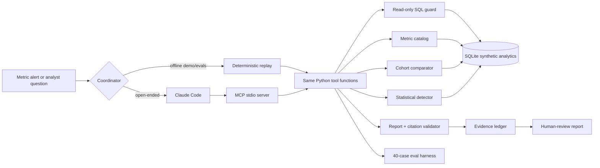

# Architecture

The boundary is intentional: the model plans and explains, while deterministic code owns facts and calculations. Claude Code is replaceable by another MCP host; the data/metric/report contract remains stable.

